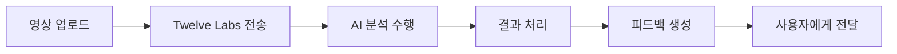

# Twelve Labs API 연동 가이드

## 📋 개요

VideoPlanet은 Twelve Labs의 고성능 비디오 이해 AI를 사용하여 영상에 대한 전문적인 피드백을 제공합니다.

## 🔑 Twelve Labs API 설정

### 1. Twelve Labs 계정 생성
1. [Twelve Labs](https://www.twelvelabs.io/) 방문
2. 회원가입 및 로그인
3. API 키 발급

### 2. 인덱스 생성
```bash
# API를 통해 인덱스 생성
curl -X POST https://api.twelvelabs.io/v1.2/indexes \
  -H "Content-Type: application/json" \
  -H "x-api-key: YOUR_API_KEY" \
  -d '{
    "index_name": "videoplanet_analysis",
    "engines": [
      {
        "engine_name": "marengo2.6",
        "engine_options": ["visual", "conversation", "text_in_video", "logo"]
      }
    ]
  }'
```

### 3. 환경 변수 설정

#### 개발환경 (.env)
```bash
# Twelve Labs API 설정
TWELVE_LABS_API_KEY=your_api_key_here
TWELVE_LABS_INDEX_ID=your_index_id_here

# 분석 제한 설정
DAILY_ANALYSIS_LIMIT=100
MONTHLY_ANALYSIS_LIMIT=1000
USER_DAILY_LIMIT=5
USER_MONTHLY_LIMIT=50

# 파일 제한
MAX_VIDEO_SIZE_MB=500
MAX_VIDEO_DURATION_MINUTES=30
FREE_USER_MAX_SIZE_MB=100
FREE_USER_MAX_DURATION_MINUTES=10

# 로깅
TWELVE_LABS_LOG_LEVEL=INFO
LOG_TWELVE_LABS_API=True
LOG_ANALYSIS_RESULTS=True
```

#### 프로덕션 환경
```bash
# 가비아 웹호스팅에서 환경 변수 설정
export TWELVE_LABS_API_KEY="your_production_api_key"
export TWELVE_LABS_INDEX_ID="your_production_index_id"
```

## 🎯 주요 기능

### 1. 영상 분석 기능
- **영상 요약**: AI가 영상 내용을 이해하고 요약
- **기술적 분석**: 구도, 조명, 음성, 안정성 등 평가
- **장면 분석**: 특정 장면과 구간 식별
- **콘텐츠 분류**: 영상 유형 자동 분류
- **개선 제안**: 구체적인 피드백과 조언

### 2. 지원 형식
- **비디오**: MP4, MOV, AVI, MKV, WMV, FLV, WebM, M4V, 3GP
- **최대 크기**: 500MB (무료 사용자: 100MB)
- **최대 길이**: 30분 (무료 사용자: 10분)

### 3. 분석 과정


## 🏗️ 구현 구조

### 1. 핵심 모듈

#### `video_analysis/analyzer.py`
```python
class TwelveLabsVideoAnalyzer:
    def analyze_video(self, video_path, feedback_id):
        # 1. 영상 업로드
        video_id = self._upload_video(video_path)
        
        # 2. 분석 실행
        result = self._perform_analysis(video_id)
        
        # 3. 결과 변환
        return self._convert_to_videoplanet_format(result)
```

#### `video_analysis/models.py`
- `VideoAnalysisResult`: 분석 결과 저장
- `AIFeedbackItem`: 개별 피드백 항목
- `AIAnalysisSettings`: 시스템 설정

### 2. API 엔드포인트

```python
# 영상 분석 실행
POST /api/video-analysis/analyze/
{
    "feedback_id": 123
}

# 분석 결과 조회
GET /api/video-analysis/result/{analysis_id}/

# AI 시스템 상태
GET /api/video-analysis/status/

# 사용자 분석 히스토리
GET /api/video-analysis/history/
```

## 💰 비용 관리

### 1. Twelve Labs 요금제
- **Starter**: $0.05/분 (월 100분 무료)
- **Growth**: $0.035/분 (대용량 할인)
- **Enterprise**: 협의

### 2. 비용 최적화 전략

#### 사용량 제한
```python
# 일일/월별 제한
DAILY_ANALYSIS_LIMIT = 100
MONTHLY_ANALYSIS_LIMIT = 1000

# 사용자별 제한
USER_DAILY_LIMIT = 5        # 무료 사용자
PREMIUM_USER_DAILY_LIMIT = 20  # 프리미엄 사용자
```

#### 파일 크기 제한
```python
# 무료 사용자: 100MB, 10분
# 프리미엄 사용자: 500MB, 30분
```

### 3. 예상 비용 계산
```python
# 예시: 5분 영상 분석
분석_비용 = 5분 × $0.05 = $0.25
월간_100회_분석 = 100 × $0.25 = $25
```

## 🔧 배포 및 설정

### 1. Django 설정 업데이트

#### `settings/base.py`
```python
# 앱 추가
INSTALLED_APPS = [
    ...
    'video_analysis',
    ...
]

# Twelve Labs 설정 import
from .twelve_labs import *
```

#### `urls.py`
```python
urlpatterns = [
    ...
    path('api/video-analysis/', include('video_analysis.urls')),
    ...
]
```

### 2. 데이터베이스 마이그레이션
```bash
python manage.py makemigrations video_analysis
python manage.py migrate
```

### 3. Celery 설정 (비동기 처리)
```python
# celery.py
from .video_analysis.tasks import analyze_video_task

# 백그라운드에서 분석 실행
analyze_video_task.delay(analysis_id, video_path)
```

## 🚀 가비아 웹호스팅 배포

### 1. 수정된 배포 전략
```
사용자 → 가비아 웹호스팅 (Django + React) → Twelve Labs API
```

**장점:**
- GPU 서버 불필요
- 월 3-5만원 비용
- 전문 AI 분석 품질
- 빠른 개발 속도

### 2. 배포 단계
1. **가비아 웹호스팅 구매** (Python/Django 지원)
2. **환경 변수 설정** (API 키 등)
3. **파일 업로드** 및 설정
4. **Twelve Labs API 테스트**

### 3. 모니터링
```python
# 사용량 추적
@api_view(['GET'])
def usage_stats(request):
    return Response({
        'daily_usage': get_daily_usage(request.user),
        'monthly_usage': get_monthly_usage(request.user),
        'remaining_quota': get_remaining_quota(request.user)
    })
```

## 🧪 테스트 및 개발

### 1. 개발 모드
API 키가 없을 때 자동으로 더미 데이터 제공:
```python
if not self.api_key:
    return self._get_enhanced_dummy_analysis(video_path)
```

### 2. 테스트 방법
```bash
# 1. 영상 파일 업로드
curl -X POST /api/feedbacks/ -F "file=@test_video.mp4"

# 2. 분석 실행
curl -X POST /api/video-analysis/analyze/ \
  -H "Authorization: Bearer YOUR_TOKEN" \
  -d '{"feedback_id": 1}'

# 3. 결과 확인
curl -X GET /api/video-analysis/result/1/
```

### 3. 로그 확인
```bash
# Django 로그
tail -f logs/video_analysis.log

# Twelve Labs API 호출 로그
grep "twelve_labs" logs/django.log
```

## 🔍 문제 해결

### 1. 일반적인 오류

#### API 키 오류
```
Error: Invalid API key
해결: TWELVE_LABS_API_KEY 환경 변수 확인
```

#### 업로드 실패
```
Error: Video upload failed
해결: 파일 크기/형식 확인, 네트워크 상태 점검
```

#### 할당량 초과
```
Error: Quota exceeded
해결: 사용량 제한 확인, 요금제 업그레이드 고려
```

### 2. 디버깅 방법
```python
# 로깅 활성화
import logging
logging.getLogger('video_analysis').setLevel(logging.DEBUG)

# API 응답 확인
logger.debug(f"Twelve Labs response: {response.json()}")
```

## 📞 지원 및 문의

### 개발팀 연락처
- **이메일**: dev@videoplanet.com
- **GitHub**: https://github.com/videoplanet/issues

### Twelve Labs 지원
- **문서**: https://docs.twelvelabs.io/
- **지원**: support@twelvelabs.io

## 🎉 다음 단계

1. **API 키 발급** 및 테스트
2. **가비아 웹호스팅** 구매 및 설정
3. **프로덕션 배포**
4. **사용자 피드백** 수집 및 개선

Twelve Labs API 연동으로 VideoPlanet의 AI 영상 분석 기능이 완성됩니다! 🚀